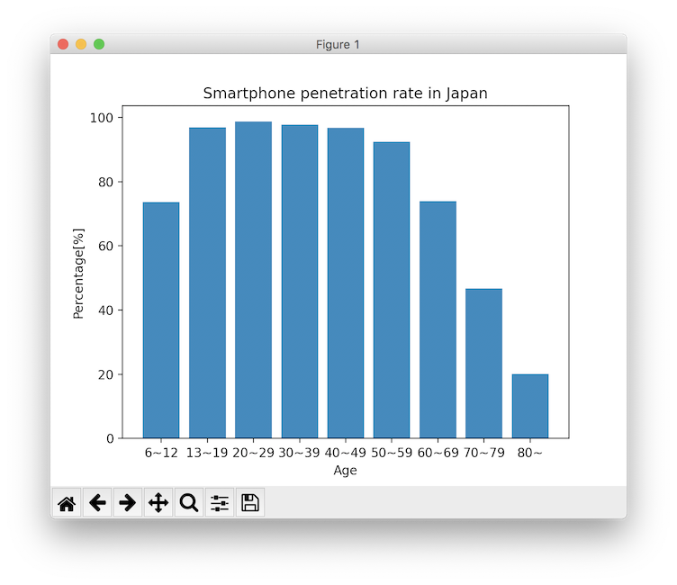
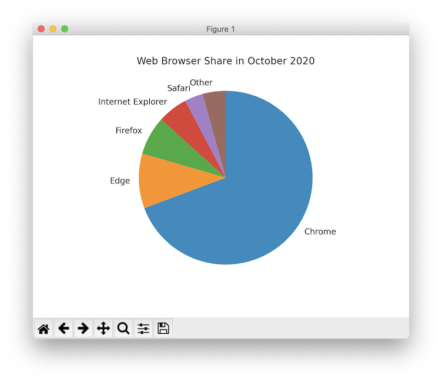

## matplotlib入門
# 第3章 棒グラフと円グラフ
matplotlibでは折れ線グラフの他にも様々なグラフを描くことができます。<br>
今回は棒グラフ、円グラフを描いてみます。<br><br>
# 棒グラフのプロット
このコードはmatplotlibを使用して棒グラフを描画するプログラムです。<br>
```py
import matplotlib.pyplot as plt

# X軸、Y軸の値を設定
x = ["6~12", "13~19", "20~29", "30~39", "40~49", "50~59", "60~69", "70~79", "80~"] # X軸: 年齢層
y = [73.6, 96.9, 98.7, 97.8, 96.8, 92.4, 73.9, 46.7, 20.1] # Y軸: スマホ普及率
f
plt.bar(x, y)  # グラフに棒グラフをプロット
plt.title("Smartphone penetration rate in Japan") # グラフタイトル「日本のスマートフォン普及率」
plt.xlabel("Age") # X軸ラベル「年齢」
plt.ylabel("Percentage[%]") # Y軸ラベル「普及率」
plt.show() # プロットしたグラフを表示
```
実行結果<br>

<br><br>
前回の折れ線グラフ描画プログラムと同じような形ですが、一点だけ大きく違うものがあります。<br>
↓このように書くと折れ線グラフではなく棒グラフでデータが表示されます。

```py
plt.bar(x, y)
```
<br><br>

# 円グラフのプロット
このコードはmatplotlibを使用して円グラフを描画するプログラムです。
```py
import matplotlib.pyplot as plt

x = [69.3, 10.2, 7.2, 5.6, 3.4, 4.3] # 各ブラウザのシェア割合
label = ["Chrome", "Edge", "Firefox", "Internet Explorer", "Safari", "Other"] # ラベルとして表示するブラウザ名

plt.pie(x, labels=label, counterclock=False, startangle=90) # グラフを描画
plt.title("Web Browser Share in October 2020") # タイトルを表示
plt.show() # プロットしたグラフを表示
```
実行結果<br>

<br><br>
円グラフの表示には、

```py
plt.pie(x, ...)
```
を使用します。<br>
今回にプログラムではxに続く引数として「表示するラベル」「時計回りに指定」「データの配置を90度スタートにする」と指定しています。

<br><br>
前: [第2章 折れ線グラフのプロット](./2.md)<br>

<br><br>
## 参考文献
・総務省 第1部　特集　人口減少時代のICTによる持続的成長<br>
https://www.soumu.go.jp/johotsusintokei/whitepaper/ja/h30/html/nd142110.html
・マイナビニュース 10月PCブラウザシェア、ChromeからEdgeへの移行兆候
https://news.mynavi.jp/article/20201103-1448633/