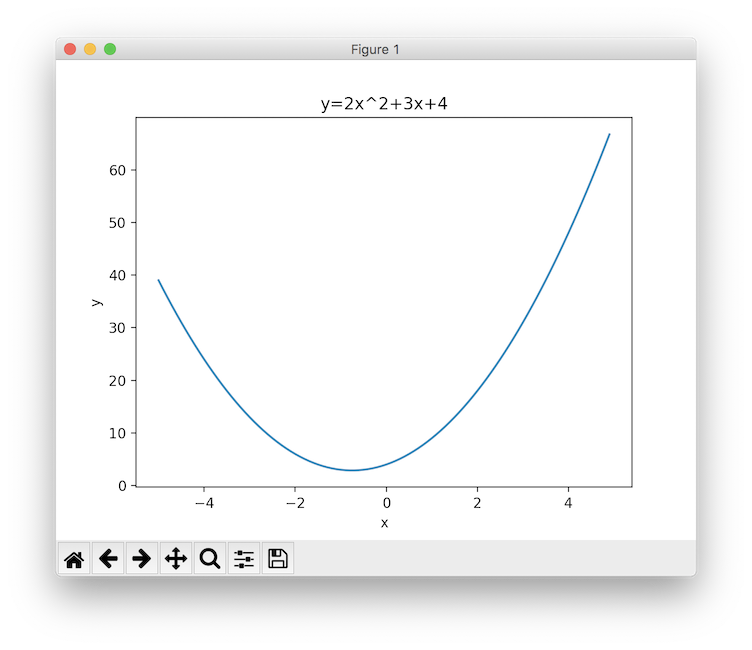

## matplotlib入門
# 第4章 1次関数と2次関数のプロット
Pythonとmatplotlibを使うことで様々な数学関数のグラフを描くこともできます。<br><br>
まずはPythonで数値計算を行うために使用するパッケージ「Numpy」をインストールします。
```
pip3 install numpy
```

# 1次関数のプロット
このコードはmatplotlibを使用して1次関数のグラフを描画するプログラムです。<br>
```py
import matplotlib.pyplot as plt
import numpy as np

x = np.arange(-5, 5, 0.1) # xの範囲を-5 ~ 5に設定し、0.1刻みで値を設定
y = 2 * x + 3 # xの値を元にyの値を設定

plt.plot(x, y) # xとyをグラフにプロット
plt.title("y=2x+3") # タイトルを設定
plt.xlabel("x") # x軸の軸ラベルを設定
plt.ylabel("y") # y軸の軸ラベルを設定
plt.show() # グラフを表示
```
実行結果<br>

<br><br>

まず今までのmatplotlib読み込み
```py
import matplotlib.pyplot as plt
```
と同じように、数値計算パッケージNumpyも読み込みます。
```py
import numpy as np
```
<br>
次に、グラフを表示する-5~5までの範囲において、0.1刻みで値が入っているNumpy用の特殊なリストを作成します。(ここでは通常のリストと同じものと考えてOKです)

```py
x = np.arange(-5, 5, 0.1) # xの範囲を-5 ~ 5に設定し、0.1刻みで値を設定
```
この命令により、xというリストには以下のような値が入ることになります。
```
[-5.0, -4.9, -4.8, ... , 4.8, 4.9]
```
続いて、作成したxの各要素に対応するyの値を計算します。
```py
y = 2 * x + 3 # xの値を元にyの値を設定
```
この命令により、yというリストには以下のような値が入ることになります。
```
[-7.0, -6.8, -6.6, ..., 12.6, 12.8]
```
<br>
最後にいつも通りグラフを描画して終了です。

```py
plt.plot(x, y) # xとyをグラフにプロット
plt.title("y=2x+3") # タイトルを設定
plt.xlabel("x") # x軸の軸ラベルを設定
plt.ylabel("y") # y軸の軸ラベルを設定
plt.show() # グラフを表示
```
リストxとyは点の集まりですが、matplotlibでプロットすると自動的に点を結んだ線として描画されます。
<br><br>

# 2次関数のプロット
今度は2次関数をプロットしてみます。<br>
```py
import matplotlib.pyplot as plt
import numpy as np

x = np.arange(-5, 5, 0.1) # xの範囲を-5 ~ 5に設定し、0.1刻みで値を設定
y = x ** 2 + 3 * x + 4 # xの値を元にyの値を設定

plt.plot(x, y) # xとyをグラフにプロット
plt.title("y=x^2+3x+4") # タイトルを設定
plt.xlabel("x") # x軸の軸ラベルを設定
plt.ylabel("y") # y軸の軸ラベルを設定
plt.show() # グラフを表示
```
実行結果<br>

<br><br>

基本は先ほどの1次関数と同じですが、以下の文に注目してみてください。
```py
y = x ** 2 + 3 * x + 4 # xの値を元にyの値を設定
```
Pythonでは「xの2乗」を表す際に「x ** 2」と書きます。これは3乗でも4乗でも同じです。
<br><br>
また、グラフが少し不格好なので、表示するxの領域を設定してみましょう。
デフォルトではリストxの範囲全て(-5.0~5.0)を描画する設定になっていますが、matplotlibでは表示する幅を広げたり狭めたりすることができます。<br>
グラフを表示(plt.show())する直前に以下の文を入れてみましょう。<br>

```py
plt.xlim(-3.5, 0.5) # x軸の表示範囲を設定
```
実行結果<br>

<br>
これでx軸の表示範囲が-3.5~0.5に設定され、グラフを中央に描画することができました。<br>
しかしy軸方向も表示範囲の調整が必要そうですね。今追加した文の下にもう1行追加してみましょう。

```py
plt.ylim(0, 7) # y軸の表示範囲を設定
```
実行結果<br>

<br>
これでy軸も表示範囲を0~7に変更することができました。<br>
表示範囲は自分でグラフを見て適宜決めていきましょう。
<br><br>
最後に完成したプログラムの全文を貼り付けておきます。

```py
import matplotlib.pyplot as plt
import numpy as np

x = np.arange(-5, 5, 0.1) # xの範囲を-5 ~ 5に設定し、0.1刻みで値を設定
y = x ** 2 + 3 * x + 4 # xの値を元にyの値を設定

plt.plot(x, y) # xとyをグラフにプロット
plt.title("y=x^2+3x+4") # タイトルを設定
plt.xlabel("x") # x軸の軸ラベルを設定
plt.ylabel("y") # y軸の軸ラベルを設定
plt.xlim(-3.5, 0.5) # x軸の表示範囲を設定
plt.ylim(0, 7) # y軸の表示範囲を設定
plt.show() # グラフを表示
```

<br><br>
前: [第3章 棒グラフと円グラフ](./3.md)<br>
次: [第5章 テキストファイルの読み込みと可視化](./5.md)<br>
