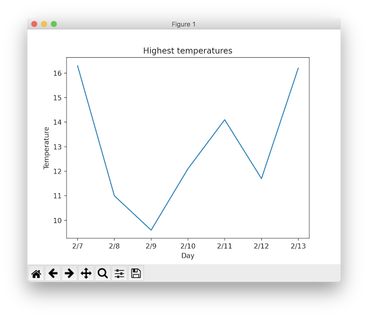
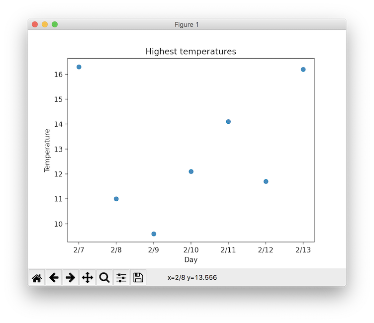
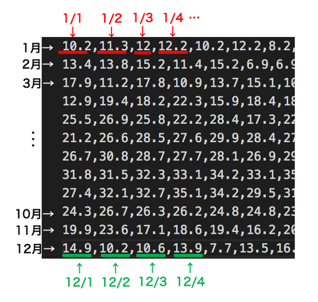
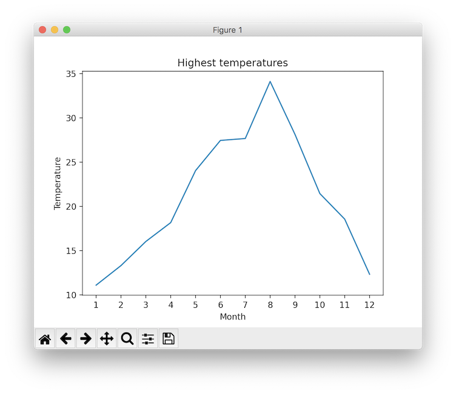

## matplotlib入門
# 第5章 テキストファイルの読み込みと可視化
Pythonではテキストファイルのデータを読み取り、解析することもできます。<br><br>

# シンプルなテキストファイルの読み込み
まずはシンプルなテキストファイルを読み込んでみましょう。<br>
[サンプルファイル](https://aquilaneo.github.io/GitHubPages/samples/sample1.txt)をダウンロードし、Pythonのソースファイルと同じ場所に「sample1.txt」という名前で保存してください。<br>
プログラムはこの通りに書いてみましょう。<br>

```py
f = open("sample1.txt") # 「sample1.txt」というテキストファイルをPythonで開く
data = f.read() # ファイル内容を全て読み込む

print(data) # 読み込んだ内容を表示
```

簡単なプログラムですが、実行するとテキストファイルの内容「Hello」が表示されるはずです。<br><br>

# ファイルの存在確認
今のプログラムは「sample1.txt」というテキストファイルを読み込んでいましたが、もしこの名前のファイルがなかったらどうなるでしょうか。<br>
テキストファイルの名前を「sample100.txt」と変えてみてそのままプログラムを実行してみましょう。<br>
実行結果<br>
```
Traceback (most recent call last):
  File "/Users/_____/Desktop/python/main.py", line 1, in <module>
    f = open("sample1.txt") # ファイルをPythonで開く
FileNotFoundError: [Errno 2] No such file or directory: 'sample1.txt'
```
エラーが出ました。「sample1.txt」というファイルは存在しないという意味です。<br>
Pythonではこのようにエラーが発生するとその時点でプログラムが強制終了してしまうため、その後の処理を続けることができません。<br><br>

実用的なプログラムを作成する際には、以下のように読み込むファイル名がちゃんと存在するかあらかじめPythonプログラム内で確認してあげるといいでしょう。<br>

```py
import os

fileName = "sample1.txt" # ファイル名を変数に置いておく

# ファイルの存在を確認
if os.path.exists(fileName):
    # ファイルが存在する場合
    f = open(fileName)
    data = f.read()
    print(data)
else:
    # ファイルが存在しない場合
    print("File not found...")
```

テキストファイルの名前を「sample100.txt」にしたまま実行すると「File not found...」と表示されますが、プログラムは強制終了せず続行できます。<br>
テキストファイルの名前を「sample1.txt」に戻して実行すると先ほどと同じようにファイル内容を読み込むことができます。<br><br>

# テキストファイルをリストに読み込み
得られるデータを効率的に解析・可視化するにはデータをPythonのリストに収納する必要があります。<br>
また新しいデータを使うので[ここ](https://aquilaneo.github.io/GitHubPages/samples/sample2.txt)からダウンロードし、Pythonソースファイルと同じ場所に「sample2.txt」という名前で保存してください。<br>
このデータは東京における2021年の2/7〜2/13までの各日の最高気温です。<br>
VSCodeでこのテキストファイルを開くと以下のように各日の最高気温をカンマ(,)で区切ったデータになっています。<br>

```
16.3,11,9.6,12.1,14.1,11.7,16.2
```

このデータのリスト化は以下のようなプログラムで行うことができます。<br>

```py
import os

fileName = "sample2.txt" # ファイル名を変数に置いておく

# ファイルの存在を確認
if os.path.exists(fileName):
    f = open(fileName) # ファイルを開く
    allData = f.read() # ファイル内容読み込み
    rawList = allData.split(",") # カンマで区切ってリストに 
    print(rawList) # リストの内容を表示
else:
    print("File not found...")
```

# テキストデータの解析
上のプログラムではテキストファイルを読み込み、無事にPythonのリストにすることができました。<br>
ここからデータを解析するにはさらに工夫を加える必要があります。<br>
テキストファイルをPythonで読み込んだ場合、そのデータは文字列型で読み込まれます。<br>
文字列型では解析する際に計算を行うことができないため、これを数値型に変換する必要があります。<br>

```py
import os

fileName = "sample2.txt" # ファイル名を変数に置いておく

# ファイルの存在を確認
if os.path.exists(fileName):
    f = open(fileName) # ファイルを開く
    allData = f.read() # ファイル内容読み込み
    rawList = allData.split(",") # カンマで区切って文字列型のリストに 
    print("文字列型リスト", rawList) # 文字列型リストの内容を表示

    # 数値型に変換
    floatList = [] # 空の数値型リストを作成
    for raw in rawList:
        floatList.append(float(raw)) # 文字列型の値を数値型に変換してfloatListに追加

    print("数値型リスト", floatList) # 数値型リストの内容を表示
else:
    print("File not found...")
```

これでようやく解析ができる形になりました。<br>
また、

```py
# 数値型に変換
floatList = [] # 空の数値型リストを作成
for raw in rawList:
    floatList.append(float(raw)) # 文字列型の値を数値型に変換してfloatListに追加
```

の部分は以下のような短縮形(リスト内包表記)で書くこともできます。<br>

```py
floatList = [float(raw) for raw in rawList] # 文字列型リストを数値型に変換
```

該当する部分を短縮形に置き換えても動くことを確認してみましょう。<br><br>

さてこれでデータを解析する準備ができました。<br>
今回は例としてこの1週間の最高気温の平均を計算してみましょう。<br>
先ほどのプログラムに平均を求める部分を追加しています。<br>

```py
import os

fileName = "sample2.txt" # ファイル名を変数に置いておく

# ファイルの存在を確認
if os.path.exists(fileName):
    f = open(fileName) # ファイルを開く
    allData = f.read() # ファイル内容読み込み
    rawList = allData.split(",") # カンマで区切って文字列型のリストに 
    print("文字列型リスト", rawList) # 文字列型リストの内容を表示

    floatList = [float(raw) for raw in rawList] # 文字列型リストを数値型に変換
    print("数値型リスト", floatList) # 数値型リストの内容を表示

    # 平均を求める
    average = sum(floatList) / len(floatList) # データの合計÷データの個数
    print("平均", average) # 平均値の表示
else:
    print("File not found...")

```

実行結果<br>
```
文字列型リスト ['16.3', '11', '9.6', '12.1', '14.1', '11.7', '16.2']
数値型リスト [16.3, 11.0, 9.6, 12.1, 14.1, 11.7, 16.2]
平均 13.0
```
<br><br>

# テキストデータの可視化
リストを数値化できればこれまで使ってきたmatplotlibでグラフ化することも可能です。
平均を求めるプログラムにグラフ化する部分を加えました。

```py
import os
import matplotlib.pyplot as plt

fileName = "sample2.txt" # ファイル名を変数に置いておく

# ファイルの存在を確認
if os.path.exists(fileName):
    f = open(fileName) # ファイルを開く
    allData = f.read() # ファイル内容読み込み
    rawList = allData.split(",") # カンマで区切って文字列型のリストに 
    print("文字列型リスト", rawList) # 文字列型リストの内容を表示

    floatList = [float(raw) for raw in rawList] # 文字列型リストを数値型に変換
    print("数値型リスト", floatList) # 数値型リストの内容を表示

    # 平均を求める
    average = sum(floatList) / len(floatList) # データの合計÷データの個数
    print("平均", average) # 平均値の表示

    # グラフ化
    x = ["2/7", "2/8", "2/9", "2/10", "2/11", "2/12", "2/13"] # Y軸を指定
    y = floatList # X軸を指定
    plt.plot(x, y) # グラフ描画
    plt.title("Highest temperatures")
    plt.xlabel("Day")
    plt.ylabel("Temperature")
    plt.show()
else:
    print("File not found...")
```

実行結果<br>

<br><br>

ちなみに、
```py
plt.plot(x, y) # グラフ描画
```
の部分を
```py
plt.scatter(x, y) # グラフ描画
```
のように変更すると点のみのグラフを描画することができます。<br>

実行結果<br>

<br><br>

# 複数行にわたるデータの読み込み
次に使うデータを[ここ](https://aquilaneo.github.io/GitHubPages/samples/sample3.txt)からダウンロードし、Pythonソースファイルと同じ場所に「sample3.txt」という名前で保存してください。<br>
```
11.9,14,15.6,11.8,12.6,12.4,15
16.3,11,9.6,12.1,14.1,11.7,16.2
```
1行目は1/31から2/6までの1週間の日別最高気温、2行目は2/7から2/13までの1週間の日別最高気温を表しています。<br>
これまでのデータとは違い、データの区切りとして「カンマ」の他に「改行」も使われています。<br>
この場合、「行で区切って読み込む」というテクニックを使うと、1週間ごとの解析を行うことができます。<br>

```py
import os
import matplotlib.pyplot as plt

fileName = "sample3.txt" # ファイル名を変数に置いておく

# ファイルの存在を確認
if os.path.exists(fileName):
    f = open(fileName) # ファイルを開く
    
    data = f.readlines() # 行ごとに区切ってリスト化
    print("行区切りデータ", data)

    # 1行目を処理
    rawList1 = data[0].split(",") # カンマで区切る
    floatList1 = [float(raw) for raw in rawList1] # 数値型リストにする

    # 2行目を処理
    rawList2 = data[1].split(",") # カンマで区切る
    floatList2 = [float(raw) for raw in rawList2] # 数値型リストにする

    # それぞれの平均を求める
    average1 = sum(floatList1) / len(floatList2)
    average2 = sum(floatList2) / len(floatList2)
    print("1週目の平均", average1)
    print("2週目の平均", average2)
else:
    print("File not found...")
```

実行結果<br>
```
行区切りデータ ['11.9,14,15.6,11.8,12.6,12.4,15\n', '16.3,11,9.6,12.1,14.1,11.7,16.2']
1週目の平均 13.328571428571427
2週目の平均 13.0
```

# 総合課題
まずは[ここ](https://aquilaneo.github.io/GitHubPages/samples/sample4.txt)から使用するテキストファイルをダウンロードし、「sample4.txt」という名前でPythonソースファイルと同じ場所に保存してください。<br>
このサンプルデータは2020年の各日の最高気温データです。<br>
データの構造は以下のように、1行目が1月、2行目が2月・・・となっていて、各行は1番最初のデータから1日、2日・・・と並んでいます。<br>

<br><br>

[総合問題1] これを解析し、各月の最高気温の平均を以下のように出力するプログラムを作成してみてください。<br>
```
1月 11.09032258064516
2月 13.303448275862065
3月 16.029032258064515
4月 18.16333333333333
5月 24.048387096774192
6月 27.459999999999997
7月 27.67741935483871
8月 34.12903225806452
9月 28.140000000000004
10月 21.448387096774194
11月 18.556666666666665
12月 12.322580645161292
```

総合問題1の解答例は[こちら](./src/question1.py)
<br><br>

[総合問題2] 計算した各月の最高気温平均を以下のようにグラフ化してみてください。<br>
<br>
総合問題2の回答例は[こちら](./src/question2.py)
<br><br>

前: [第4章 1次関数と2次関数のプロット](./4.md)
<br>

## 参考文献
・気象庁 | 過去の気象データ<br>
https://www.data.jma.go.jp/gmd/risk/obsdl/index.php
