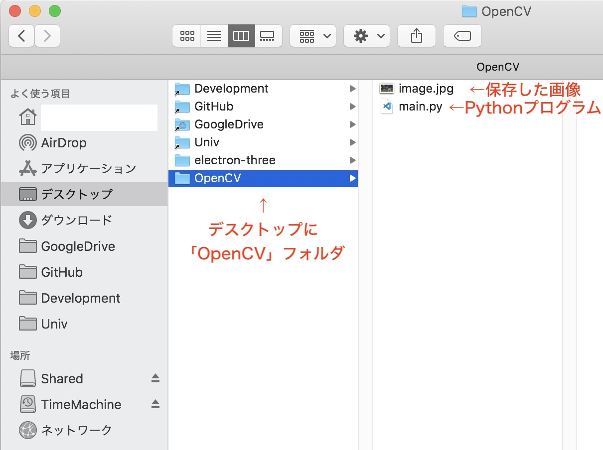

## OpenCV入門
# 第1章 OpenCVの導入と画像の読み込み・表示
# OpenCVのインストール
まずはmatplotlibのときと同じようにpipを使ってOpenCVをインストールしてみましょう。
```
pip3 install opencv-python
```
最後に「Successfully installed opencv-python-4.4.0.46」と出ればインストール成功です。エラーが出た場合は「pip3」を「pip」に変えてやってみてください。
<br><br>

# OpenCVによる画像の読み込みと表示
まずは画像処理に使うサンプル画像をダウンロードしてきましょう。[OpenCVの日本語チュートリアルサイト](http://labs.eecs.tottori-u.ac.jp/sd/Member/oyamada/OpenCV/html/py_tutorials/py_core/py_basic_ops/py_basic_ops.html)から以下の画像を保存します。<br>
<br>

今回はデスクトップにプログラムを配置する「OpenCV」フォルダを作成し、以下のように配置した前提で説明します。<br>
この画像と配置やファイル・フォルダ名が違う場合は適宜読み替えて進めてください。<br>
<br>
<br>
それでは早速OpenCVを使ったプログラムを作成していきます。まずはこの画像をPythonプログラムで読み込み、画面に表示させてみます。<br>
キーボードのキーをどれか押すとプログラムが終了します。<br>

```py
import cv2 # OpenCVを読み込み

img = cv2.imread("image.jpg") # 画像ファイルを読み込み
cv2.imshow("Window1", img) # ウィンドウを作成し、画像をそこに表示
cv2.waitKey(0) # 何かキーが押されるまで待つ
cv2.destroyAllWindows() # ウィンドウを全て閉じる
```
実行結果<br>
<br><br>

まず次の文でOpenCVを読み込みます。
```py
import cv2 # OpenCVを読み込み
```

次の文では「image.jpg」という名前の画像を、「img」という変数に読み込んでいます。
```py
img = cv2.imread("image.jpg") # 画像ファイルを読み込み
```

「Window1」という名前のウィンドウを作成し、変数imgに入っている画像をそのウィンドウに表示します。
```py
cv2.imshow("Window1", img) # ウィンドウを作成し、画像をそこに表示
```

このままプログラムを実行し続けるとすぐにウィンドウが閉じてしまうため、次の命令を使ってキーボードのキーが押されるまで待機しています。
```py
cv2.waitKey(0) # 何かキーが押されるまで待つ
```

キーが押されると、作成した全てのウィンドウ(ここでは「Window1」のみ)を次の文で全て閉じ、プログラムが終了します。
```py
cv2.destroyAllWindows() # ウィンドウを全て閉じる
```

これでOpenCVを使った画像の読み込みと表示ができました。

<br><br>
次: [第2章 デジタル画像の基礎知識](./2.md)