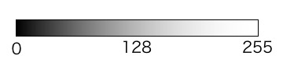

## OpenCV入門
# 第2章 デジタル画像の基礎知識
# デジタル画像とは？
さっそく画像処理に入ってきたいのですが、まずはこれから扱う「デジタル画像」について説明していきたいと思います。 
デジタル画像はコンピュータから扱う画像データのことで、一般的には「点の集まり」で表します。
  

# 画素
 
この画像では各点は白か黒かを表しており、この点のことを「画素」または「ピクセル(pixel)」と呼びます。 
上図は横方向に8画素、縦方向に8画素の合計64画素で構成されています。 
 
より画素数を増やして顔を描くとこのようになります。 
 
今回は横方向に16画素、縦方向に16画素の合計256画素まで画素数を増やしました。 
(Excelで手書きしたのでヘタクソですが...)先ほどの画像より点が細かくなり表現できる幅が広がったのがわかるかと思います。 
 
これをさらに細かくしていったものが私たちがよく使う写真などのデジタル画像になります。 
iPhoneで写真を撮ってみると、横方向に3024画素、縦方向に4032画素の合計12192768画素もありました。 
(実は画素を使わないタイプのデジタル画像もあるのですが、ここでは説明しません)
  

# 画素と色
上図の各画素には「白か黒か」という2種類の情報しか持っていません。このような2種類の色情報のみを持った画像のことを「2値画像」と呼びます。
  

2値画像の白黒に加え、灰色といった中間の色も表現できるようになったのが「グレースケール画像」です。 
 
グレースケール画像の各画素は「色の濃さ」という情報がを持っています。 
この情報は0~255までの256段階の数字で表されることが多く、真っ黒を0、真っ白を255として、その間の色の濃淡を数字の大きさで表現します。 
この数字の大きさのことを「輝度値」と呼びます。 

  

# RGB色空間
私たちが最もよく目にするのは以下のようなカラー画像でしょう。 
 
カラー画像は私たちが実際に目にするような様々な色を表すことができます。 
デジタル画像においてはカラー画像は「赤」「緑」「青」という光の三原色の組み合わせで表現されます。 
 
カラー画像では各画素をこの赤緑青(RGB)という3つの変数(それぞれ0〜255までの256段階であることが多い)で表されます。 
(OpenCVではBGRという並びで扱うことが多い) 
 
  

OpenCVの画像プレビュー画面には各画素のRGB値を確認することができる便利な機能があります。前の章で作成したプログラムを実行してみましょう。 
 
プレビュー画面の一番下にXY座標と画素のRGB値が表示されています。これはマウスカーソルを合わせた点の座標とRGB値を見ることができる機能です。 
画像上の様々な点(ユニフォームの赤いところ、青いところ、芝生など)にカーソルを当てて、画素値を確認してみてください。
  

# HSV色空間
RGB色空間の他にカラー画像を表す方法としてHSV色空間という方法もあります。RGBは光の三原色を使って色を表すのに対し、HSVはHue(色相: 色合い)、Saturation(彩度: 鮮やかさ)、Value(明度: 明るさ)という3変数を使う方式です。 
一般的にHは0°から360°、SとVはそれぞれ0%から100%までの値をとりますが、OpenCVではHが0〜179、SとVが0〜255の値をとります。 
HSV色空間はRGBに比べ直感的に画像の色を扱うことができます。 

  
前: [第1章 OpenCVの導入と画像の読み込み・表示](./1.md)

  
## 参考文献
・光の三原色RGB ニコニ・コモンズ 
https://commons.nicovideo.jp/material/nc204551